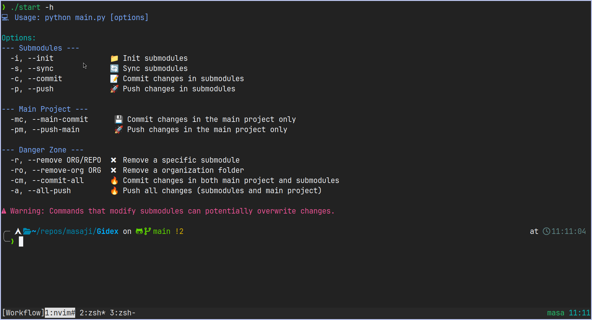

# Gidex

Gidex is a command-line tool designed for synchronizing GitHub repositories as submodules within a local repository. This is particularly useful for managing dependencies and collaborating across multiple projects within specified organizations.

<p align="center">
  
</p>

## Development Status
Warning: Gidex is currently in the development stage and may contain bugs or incomplete features. Use this tool at your own risk, as it may lead to unexpected behavior or data loss. It is recommended to test in a safe environment before using it in production.

## Installation

To install Gidex, follow these steps:

```sh
$ git clone https://github.com/masajinobe-ef/gidex.git --depth=1
$ cd gidex
$ sudo chmod +x start
$ ./start -h
```

Edit the orgs.toml file to specify the organizations whose repositories you want to synchronize.

## License

Gidex is licensed under the GPL-3.0 License. You can view the full license text in the LICENSE file in the repository.
